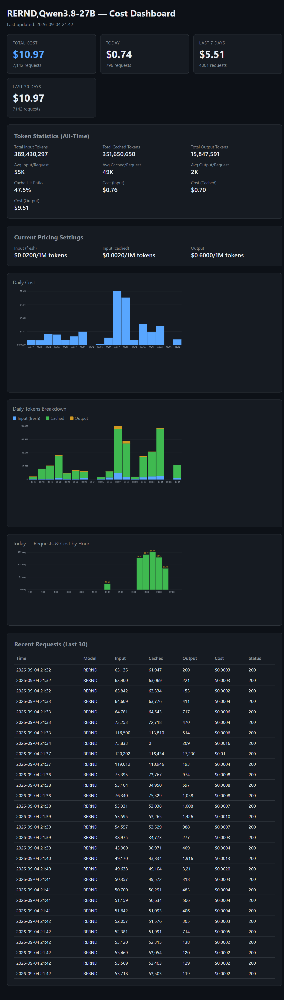
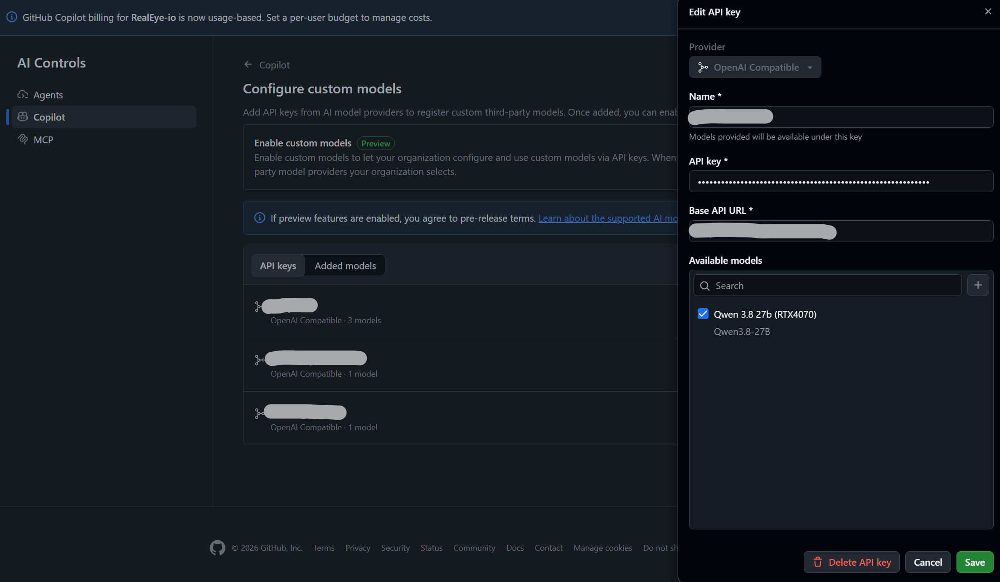
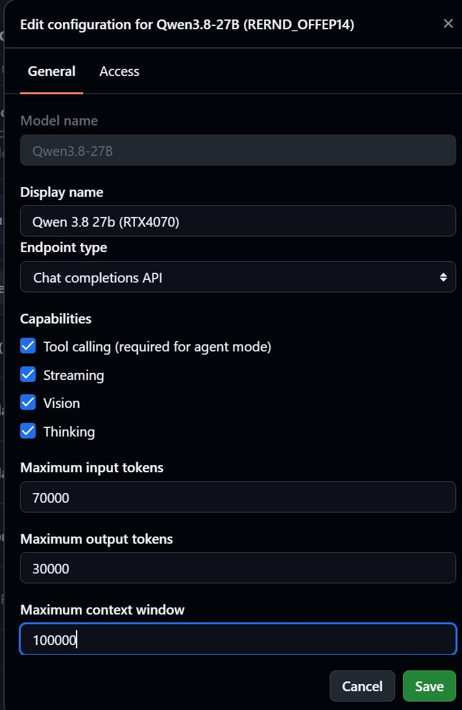
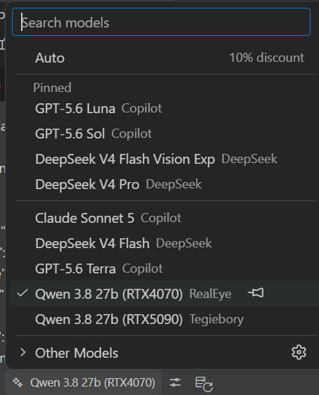
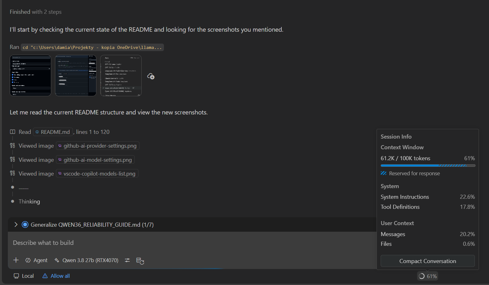

# llamacpp-server

A wrapper around an embedded [`llama.cpp`](https://github.com/ggml-org/llama.cpp) checkout that serves **Qwen 3.8 27B** multimodal GGUF models via `llama-server` on an NVIDIA GPU, with a **Cloudflare Tunnel + SSE keepalive proxy** that eliminates VS Code GitHub Copilot timeouts during long LLM inference.

The headline problem this solves: when you route VS Code Copilot (or any OpenAI-compatible client) through Cloudflare to a local `llama-server`, Cloudflare's ~120-second proxy read timeout kills any request whose first byte takes longer than that — which is common with 27B models, long prompts, and tool-calling workloads. This repo ships a tiny local timeout proxy that emits early SSE keepalive bytes so Cloudflare never sees a stalled connection.

> **Production proven.** This exact setup is proven to work great in production for commercial work. It's sometimes used **directly as the model backend for VS Code GitHub Copilot** — see [Using with VS Code GitHub Copilot](#using-with-vs-code-github-copilot).

> **Platform support.** This setup works well on **Linux (native)** and on **WSL2** (Windows Subsystem for Linux). On WSL2 the NVIDIA driver is supplied by the Windows host — see [Prerequisites](#prerequisites) and the WSL2 provisioning steps in [Quick start](#quick-start).


## Architecture

```
Internet
  │
  ▼
Cloudflare Edge (your custom hostname)
  │
  ▼
Cloudflare Tunnel (cloudflared, Docker container)
  │
  ▼
localhost:8080  ──►  cloudflare-timeout-proxy.py
  │                    (SSE keepalives, sampling clamp,
  │                     tool-result nudge, request capture)
  │
  ▼
localhost:8081  ──►  llama-server (llama.cpp, CUDA)
```

- **`cloudflared`** (Docker) — remotely-managed Cloudflare Tunnel connector, started/stopped by `run-paq-llamacpp-server.sh`
- **`cloudflare-timeout-proxy.py`** — Python stdlib-only proxy that sits between Copilot and `llama-server`. Sends 15-second SSE keepalive pings while waiting for upstream response headers, clamps sampling parameters for stable tool-call JSON, and injects a nudge after tool-result turns to prevent premature stopping.
- **`llama-server`** — the actual inference engine, built from the embedded `llama.cpp` checkout with CUDA.

## What this project does

- launches `llama-server` from the local `llama.cpp` build
- serves a local multimodal Qwen 3.8 27B model via `--mmproj`
- loads runtime overrides from a root `.env` file
- supports optional API-key auth and TLS certificates
- exposes OpenAI-style endpoints (`/v1/chat/completions`, `/v1/responses`, etc.)
- can optionally start a local `cloudflared` connector container for a remotely-managed Cloudflare Tunnel
- can optionally front `llama-server` with a tiny local timeout proxy that emits early bytes/heartbeats for long Cloudflare-routed inference requests
- can be installed as a host-wide `systemd` service that starts at boot and restarts on failure
- keeps the large model files, toolchains, caches, and secrets out of Git
- includes host-side helpers for `systemd` startup and NVIDIA power limiting
- includes a lightweight **cost dashboard** (`cost_dashboard.py`) that reads the request/cost CSV logs and renders a self-contained web page with total cost, token statistics, cache hit ratio, and a daily cost chart
- is proven in production for commercial work and can be used **directly as the VS Code GitHub Copilot model backend**

## Cost dashboard

`cost_dashboard.py` is a dependency-free (Python stdlib only) web app that turns the per-request cost CSV logs into a live dashboard. It reports total/today/7-day/30-day cost, input/cached/output token counts, cache hit ratio, current pricing settings, and a daily cost chart.



## Using with VS Code GitHub Copilot

This setup is proven to work great in production for commercial work, and is sometimes used **directly as the model backend for VS Code GitHub Copilot**. You register the server as a custom **OpenAI Compatible** model in GitHub's AI Controls, and it then shows up in the VS Code Copilot model picker alongside the built-in models — usable for both chat and agent mode.

### GitHub.com — register the custom model

1. Open **Settings → AI Controls → Copilot → Configure custom models**.
2. Add an **API key** with provider **OpenAI Compatible**: set the name, your API key, and the **Base API URL** (your public hostname ending in `/v1`, e.g. `https://your-llm-host.example/v1`).
3. Add the model (e.g. `Qwen3.8-27B`) and configure its capabilities (tool calling, streaming, vision, thinking) and token limits.





### VS Code — pick the model

Once registered, the model appears in the Copilot model picker in VS Code, ready to use:



And in action — the custom model selected in Agent mode, with the session context panel on the right:



### Tool-result continuation nudge (VS Code Copilot compatibility)

A key reason this setup works reliably in **agent mode** is a small "trick" built into the timeout proxy. After a successful tool result, Qwen 3.8 can intermittently **stop prematurely in the reasoning/thinking channel** — it emits EOS with no visible content and no `tool_call`. Because Copilot hides reasoning and has no tool to execute, the agent then appears to halt mid-task.

To prevent this, the proxy appends a **hidden `user`-role nudge message** to the request whenever the last message is a tool result. The nudge forces the model to *continue* — emitting either a valid `tool_call` or visible assistant content — instead of ending its turn inside the reasoning channel. It mirrors the context refresh Copilot sends when it later recovers, and it does not alter the tool output itself.

- **Enabled by default** in the checked-in profiles (`LLAMA_PROXY_NUDGE_AFTER_TOOL_RESULT=on`).
- The nudge text is configurable via `LLAMA_PROXY_TOOL_RESULT_NUDGE_TEXT`. The built-in default is:

  > Continue after the latest tool result. Do not stop in the reasoning/thinking channel. Before finishing, you must emit either a valid tool_call or visible assistant content. If any planned work remains, call the next appropriate tool now. Do not merely describe the next step in reasoning.

Disable it with `LLAMA_PROXY_NUDGE_AFTER_TOOL_RESULT=off` if you are not driving the server from VS Code Copilot and do not need the continuation behavior.

### Example `chatenginemodels.json`

An example VS Code `chatenginemodels.json` with both variants (16 GB / RTX 4070 and 32 GB / RTX 5090) based on this setup (also checked in as [`chatenginemodels.json`](chatenginemodels.json)):

```json
[
    {
        "name": "16GBVRAM",
        "vendor": "customendpoint",
        "apiType": "chat-completions",
        "models": [
            {
                "id": "RERND",
                "name": "Qwen 3.8 27b (RTX4070)",
                "url": "https://your-llm-host.example/v1",
                "streaming": true,
                "toolCalling": true,
                "vision": true,
                "maxInputTokens": 70000,
                "maxOutputTokens": 30000,
                "contextWindow": 100000
            }
        ],
        "apiKey": "${input:chat.lm.secret.-64847427}"
    },
    {
        "name": "32GBVRAM",
        "vendor": "customendpoint",
        "apiKey": "${input:chat.lm.secret.-64847427}",
        "apiType": "chat-completions",
        "models": [
            {
                "id": "RERND",
                "name": "Qwen 3.8 27b (RTX5090)",
                "url": "https://your-llm-host.example/v1",
                "streaming": true,
                "toolCalling": true,
                "vision": true,
                "maxInputTokens": 150000,
                "maxOutputTokens": 50000,
                "contextWindow": 200000
            }
        ]
    }
]
```

## Model profiles

Two pre-configured profiles are checked in. Both target **Qwen 3.8 27B** (multimodal, MTP speculative decoding, vision via mmproj).

| Profile | Quantization | Context | VRAM | Profile file | Switch command |
|---------|-------------|---------|------|-------------|----------------|
| `qwen38-16gb` | Q3_K_XL | 100K | ~16 GB | `dot.env.qwen38-27b-q3kxl-100k-16gb` | `sudo bash scripts/switch-model.sh qwen38-16gb` |
| `qwen38-32gb` | Q5_K_XL | 200K | ~32 GB | `dot.env.qwen38-27b-q5kxl-200k-32gb` | `sudo bash scripts/switch-model.sh qwen38-32gb` |

**Models are NOT included in this repo.** Download them from Hugging Face:

- [unsloth/Qwen3.8-27B-GGUF](https://huggingface.co/unsloth/Qwen3.8-27B-GGUF) — pick the Q3_K_XL or Q5_K_XL variant
- Place the model file in `models/` and the matching mmproj file alongside it

Both profiles use the froggeric v22.1 chat template (`chat_templates/chat_template.jinja`) with `reasoning_effort: medium` by default (clients can override per request).

> **Note:** Since Qwen 3.8 27B, the custom chat template fix is no longer strictly needed — the model's built-in template handles tool calls correctly. The template file is kept in the repo "just in case" and can be removed if you prefer the stock template.

> **Tuned for occasional vision analysis.** These profiles are tuned for **rare / occasional vision (image) analysis**, not for heavy continuous multimodal workloads. The vision projector (`mmproj`) is **not GPU-offloaded** — it runs on the CPU — so image-heavy requests are slower than pure-text inference. For the intended use (mostly text, with the occasional screenshot or image), this is a good trade-off: it keeps the full GPU dedicated to the LLM weights and KV cache. If you need fast, frequent vision, look into offloading the mmproj to the GPU and re-tuning the profile.

## Freeing all dGPU VRAM for the LLM (use the iGPU for display)

On a desktop with **both** an integrated GPU (Intel/AMD iGPU) and a dedicated NVIDIA GPU (dGPU), the display output can be routed through the **iGPU** so the **dGPU is used purely for compute**. This frees **100% of the dGPU's VRAM** for the LLM (weights + KV cache), because the dGPU no longer has to reserve memory for the framebuffer/display.

- **On WSL2** this is already the default situation: Windows owns the display, and the NVIDIA GPU inside the WSL2 distro is a **compute-only** device. So all of its VRAM is already available to `llama-server` — nothing extra to configure.
- **On native Linux** you typically route the monitor through the iGPU and let the dGPU do compute only. Common approaches:
  - **PRIME render-offload** — set the iGPU as the display/output provider and the NVIDIA dGPU as the render provider (or vice-versa, depending on your goal). On X11 this is often done with `xrandr --setprovideroutputsource` / `xrandr --output <MONITOR> --auto` after selecting the iGPU provider.
  - **Configure your compositor/WM** to output through the iGPU (e.g. in `xorg.conf` via the `nvidia` + `intel`/`amdgpu` PRIME setup, or in Wayland compositors by choosing the iGPU as the output device).
  - Verify with `nvidia-smi` that the dGPU shows **no display clients** and that its full VRAM is free for compute.

The exact steps depend on your hardware and desktop environment, so treat this as a starting point and adapt to your setup.

## Workspace layout

```text
.
├── .env                         # local runtime overrides (not committed)
├── .env.example                 # documented template for .env
├── .cloudflared/                # generated local tunnel token file(s) (ignored)
├── .gitignore                   # ignores models, caches, secrets, envs, etc.
├── README.md                    # this file
├── chatenginemodels.json        # example VS Code Copilot custom-model config
├── LICENSE                      # Apache License 2.0
├── NOTICE                       # attribution notices
├── api-keys.txt                 # optional llama.cpp API key file (ignored)
├── install-systemd-service.sh   # installs/enables the host-wide model service
├── paq-llamacpp-server.service       # systemd unit for the main launcher
├── certs/
│   └── openssl-san.cnf          # OpenSSL SAN config for local TLS
├── chat_templates/
│   └── chat_template.jinja      # froggeric v22.1 chat template
├── cuda-env                     # ignored symlink to /usr/local/cuda-* (not vendored)
├── hf-cache/                    # Hugging Face cache (ignored)
├── llama.cpp/                   # embedded upstream repo (ignored by this root repo)
├── models/                      # model + mmproj files (ignored)
├── paq-llamacpp-server-base-meta/             # model metadata (config.json, tokenizer, etc.)
├── cloudflared.compose.yaml     # Cloudflare Tunnel connector container definition
├── cloudflare-timeout-proxy.py  # SSE keepalive timeout proxy (Python stdlib)
├── run-paq-llamacpp-server.sh                 # main launcher
├── stop-paq-llamacpp-server.sh                # stop the local server and optional tunnel connector
├── set-gpu-power-limit.sh       # GPU power cap helper
├── nvidia-power-limit.service   # systemd unit for the GPU power cap helper
├── dot.env.qwen38-27b-q3kxl-100k-16gb   # 16 GB profile
├── dot.env.qwen38-27b-q5kxl-200k-32gb   # 32 GB profile
├── scripts/
│   ├── provision-wsl2-ubuntu.sh # WSL2 provisioning + llama.cpp build
│   ├── switch-model.sh          # switch between model profiles via systemd drop-in
│   └── toolcall-stress.py       # tool-call reliability stress test
└── docs/
    ├── SETUP.md                 # full setup guide
    ├── QWEN38_RELIABILITY_GUIDE.md  # Qwen-specific operational hardening
    ├── UPDATING_CUDA.md         # CUDA toolkit upgrade guide
    ├── TUNING_REPORT.md         # batch/ubatch tuning benchmarks
    └── FIXME_QWEN_TOOL_PARSING.md   # tool-call parsing investigation notes
```

## Prerequisites

You will need:

- Linux (native or WSL2)
- an NVIDIA GPU (tested on RTX 5090 32 GB; 16 GB profiles work on 16 GB cards)
- `nvidia-smi`
- a CUDA-enabled `llama.cpp` build at `llama.cpp/build/bin/llama-server`
- a CUDA toolkit installed under `/usr/local/cuda-*`; `cuda-env` is the local symlink that gives builds and scripts a stable path to that toolkit
- the model and mmproj files in `models/`
- Docker (for the optional Cloudflare Tunnel connector)

On WSL2, the NVIDIA driver is supplied by the Windows host. Do not install a separate Linux NVIDIA driver in the distribution. The launcher automatically prefers the host-matched WSL driver directory for CUDA's PTX JIT library.

The launcher validates several of these assumptions before starting.

## Quick start

### 1. Provision WSL2 Ubuntu (recommended)

Run from **inside the Ubuntu WSL2 distribution** after the Windows NVIDIA driver and WSL have been updated:

```bash
bash scripts/provision-wsl2-ubuntu.sh
```

The provisioning script is safe to rerun. It:

- installs ordinary Ubuntu build prerequisites (`cmake`, compilers, Python, Git)
- verifies the Windows-provided WSL CUDA bridge, `nvidia-smi`, and host-matched driver tree
- selects the newest `/usr/local/cuda-*` toolkit, creates/repairs the `cuda-env` symlink
- configures and builds `llama-server` with CUDA, all-quant Flash Attention
- runs `llama-server --version` with the corrected WSL library ordering

This checkout targets an RTX 5090 (`sm_120a`). For another GPU, override the architecture:

```bash
bash scripts/provision-wsl2-ubuntu.sh --arch 86
```

> **Updating the CUDA toolkit?** Use the dedicated [`docs/UPDATING_CUDA.md`](docs/UPDATING_CUDA.md) guide.

### 2. Put the model files in place

Download from [Hugging Face](https://huggingface.co/unsloth/Qwen3.8-27B-GGUF) and place in `models/`:

- `models/Qwen3.8-27B-UD-Q5_K_XL.gguf` (32 GB profile) or `models/Qwen3.8-27B-UD-Q3_K_XL.gguf` (16 GB profile)
- `models/mmproj-qwen38-27b-F16.gguf` (vision projector)

### 3. Create `.env`

Copy the template and adjust:

```bash
cp .env.example .env
```

The `.env.example` defaults to the 32 GB Q5_K_XL profile. For the 16 GB profile, either edit `.env` or use the profile overlay:

```bash
PAQ_LLAMACPP_SERVER_ENV_FILE=dot.env.qwen38-27b-q3kxl-100k-16gb ./run-paq-llamacpp-server.sh
```

### 4. Start the server

```bash
./run-paq-llamacpp-server.sh
```

By default the server binds to `0.0.0.0:8080`. If `CLOUDFLARED_TUNNEL_TOKEN` is set, the `cloudflared` connector container is also started. If `CLOUDFLARE_TIMEOUT_PROXY_MODE` is enabled, the timeout proxy listens on `8080` and `llama-server` moves to `8081`.

### 5. Stop the server

```bash
./stop-paq-llamacpp-server.sh
```

## GitHub Copilot setup (VS Code + Copilot CLI)

To run this stack as a Copilot-compatible model endpoint, keep reasoning enabled and normalize outgoing sampling for tool-call stability.

Recommended `.env` block:

```env
REASONING=auto
REASONING_BUDGET=
REASONING_BUDGET_MESSAGE=

CLOUDFLARE_TIMEOUT_PROXY_MODE=stream
LLAMA_PROXY_CLAMP_TEMPERATURE=0.6
LLAMA_PROXY_CLAMP_TOP_P=0.95
LLAMA_PROXY_SET_TOP_K=20
LLAMA_PROXY_MAX_TOKENS_CTX_PCT=50
```

Notes:

- Use OpenAI-compatible base URL pointing at this launcher (`https://<host>:<port>/v1` for direct access, or your Cloudflare hostname ending in `/v1` when tunneled).
- Use `MODEL_ALIAS` from your `.env` as the model name in Copilot configuration.
- Real VS Code Copilot traffic commonly sends `temperature=1`, `top_p=1`, and no explicit `max_tokens`; the clamp settings above bring sampling back to Qwen-friendly values for stable tool-call JSON.
- For remote Copilot usage, set `CLOUDFLARED_TUNNEL_TOKEN` and keep `CLOUDFLARED_ENABLED=auto` so the connector container is managed by `run-paq-llamacpp-server.sh`.

## Choosing a Cloudflare timeout-proxy mode

The timeout proxy is **separate** from the Cloudflare Tunnel connector:

- `CLOUDFLARED_*` decides whether a local `cloudflared` container publishes your hostname through Cloudflare Tunnel.
- `CLOUDFLARE_TIMEOUT_PROXY_*` decides whether a small local front proxy sits in front of `llama-server` to emit early bytes before the backend is ready.

When enabled, the timeout proxy keeps the public `HOST` / `PORT` for clients and moves the actual `llama-server` backend to `CLOUDFLARE_TIMEOUT_PROXY_BACKEND_HOST` / `CLOUDFLARE_TIMEOUT_PROXY_BACKEND_PORT` (default: `PORT + 1`).

For the usual `PORT=8080` setup:

- `8080` is the public listener and the port clients should use
- `8081` is the private `llama-server` backend when the proxy is enabled
- with `CLOUDFLARE_TIMEOUT_PROXY_MODE=off`, `llama-server` itself listens on `8080`

### `CLOUDFLARE_TIMEOUT_PROXY_MODE=off`

Use `off` when:

- you are calling the server locally or over a direct/non-proxied path
- your first byte already arrives comfortably inside Cloudflare's timeout window
- or your client is very strict about raw upstream behavior

### `CLOUDFLARE_TIMEOUT_PROXY_MODE=stream`

Use `stream` when:

- your client sends `"stream": true`
- you want Cloudflare protection against slow first byte
- you want non-stream requests to continue behaving as strict pass-through

In `stream` mode, only JSON inference requests with `"stream": true` get early SSE keep-alives. Non-stream JSON requests are forwarded normally.

### `CLOUDFLARE_TIMEOUT_PROXY_MODE=optimistic`

Use `optimistic` when:

- your client needs non-stream JSON responses
- Cloudflare is in front
- slow prompt prefill can exceed the first-byte timeout

In `optimistic` mode, the proxy immediately starts a chunked `200 OK` response and emits whitespace heartbeats until the upstream response is ready. The trade-off: if the upstream later fails with HTTP `4xx`/`5xx`, the proxy can return a valid error body but cannot change the already-started `200 OK` status line.

## Install as a boot-time service

This repo includes a host-wide `systemd` unit that runs `run-paq-llamacpp-server.sh` as the owner of the current checkout:

- starts automatically after host reboot
- restarts the launcher if it exits unexpectedly
- keeps `.env` loading and optional timeout-proxy / `cloudflared` orchestration inside `run-paq-llamacpp-server.sh`

Install and enable it with:

```bash
sudo ./install-systemd-service.sh
```

Useful service commands:

```bash
sudo systemctl status paq-llamacpp-server.service
sudo journalctl -u paq-llamacpp-server.service -f
sudo systemctl restart paq-llamacpp-server.service
sudo systemctl stop paq-llamacpp-server.service
```

### Switching model profiles

```bash
sudo bash scripts/switch-model.sh qwen38-16gb
sudo bash scripts/switch-model.sh qwen38-32gb
```

This writes a systemd drop-in override for `PAQ_LLAMACPP_SERVER_ENV_FILE`, reloads systemd, and restarts the service.

## Important environment variables

| Variable | Default | Purpose |
|---|---:|---|
| `HOST` | `0.0.0.0` | bind address |
| `PORT` | `8080` | server port |
| `MODEL` | (profile-specific) | path to the GGUF model file |
| `MMPROJ` | (profile-specific) | path to the mmproj vision file |
| `MODEL_ALIAS` | `PAQ_LLAMACPP_SERVER` | alias shown by the server |
| `CTX_SIZE` | (profile-specific) | runtime context window |
| `BATCH_SIZE` | (profile-specific) | logical batch size |
| `UBATCH_SIZE` | (profile-specific) | micro-batch size |
| `THREADS` | `8` | inference threads |
| `THREADS_BATCH` | `16` | batch threads |
| `THREADS_HTTP` | `4` | HTTP worker threads |
| `PARALLEL` | `1` | number of server slots; >1 is experimental |
| `KV_UNIFIED` | `0` | unified KV buffer; prefer `0` for correctness |
| `FLASH_ATTN` | `on` | flash attention toggle |
| `CACHE_TYPE_K` | (profile-specific) | K cache precision |
| `CACHE_TYPE_V` | (profile-specific) | V cache precision |
| `PROMPT_CACHE` | `1` | enable prompt cache |
| `CTX_CHECKPOINTS` | (profile-specific) | max context checkpoints per slot |
| `CACHE_RAM_MIB` | `8192` | prompt-cache RAM limit in MiB |
| `CACHE_IDLE_SLOTS` | `0` | save/clear idle slots |
| `WARMUP` | `0` | warm model on startup |
| `REASONING` | `auto` | enable reasoning mode |
| `REASONING_BUDGET` | empty | optional cap on reasoning tokens |
| `SPEC_TYPE` | `draft-mtp` | speculative decoding type |
| `SPEC_DRAFT_N_MAX` | (profile-specific) | max draft tokens for MTP |
| `LLAMA_SERVER_API_KEY_FILE` | empty | optional API key file |
| `LLAMA_SERVER_SSL_KEY_FILE` | empty | optional TLS private key |
| `LLAMA_SERVER_SSL_CERT_FILE` | empty | optional TLS certificate |
| `PAQ_LLAMACPP_SERVER_ENV_FILE` | empty | optional overlay env file loaded on top of `.env` |
| `CLOUDFLARED_TUNNEL_TOKEN` | empty | optional Cloudflare Tunnel token |
| `CLOUDFLARED_ENABLED` | `auto` | `auto` starts connector when token present; `off` to disable |
| `CLOUDFLARED_IMAGE` | `cloudflare/cloudflared:2026.2.0` | cloudflared Docker image |
| `CLOUDFLARE_TIMEOUT_PROXY_MODE` | `off` | `off` / `stream` / `optimistic` |
| `CLOUDFLARE_TIMEOUT_PROXY_BACKEND_HOST` | `127.0.0.1` | private host where llama-server binds |
| `CLOUDFLARE_TIMEOUT_PROXY_BACKEND_PORT` | `PORT + 1` | private backend port |
| `CLOUDFLARE_TIMEOUT_PROXY_HEARTBEAT_SECONDS` | `15` | seconds between keep-alive pings |
| `LLAMA_PROXY_CLAMP_TEMPERATURE` | empty | proxy-side cap for outgoing `temperature` |
| `LLAMA_PROXY_CLAMP_TOP_P` | empty | proxy-side cap for outgoing `top_p` |
| `LLAMA_PROXY_SET_TOP_K` | empty | proxy-side set/cap for outgoing `top_k` |
| `LLAMA_PROXY_MIN_MAX_TOKENS` | empty | optional floor for existing `max_tokens` caps |
| `LLAMA_PROXY_MAX_TOKENS_CTX_PCT` | `50` | output token ceiling as % of CTX_SIZE |
| `LLAMA_PROXY_STREAM_KEEPALIVE_MODE` | `comment` | `comment` (SSE) or `data` (empty-delta chunk) |
| `LLAMA_PROXY_NUDGE_AFTER_TOOL_RESULT` | `off` | append nudge after tool-result turns |
| `LLAMA_PROXY_CAPTURE_ENABLED` | `off` | toggle raw inference-request capture |
| `LLAMA_PROXY_CAPTURE_DIR` | empty | directory for captured request payloads |

## Safety checks built into the launcher

Before starting, `run-paq-llamacpp-server.sh` checks:

- the server binary exists
- the CUDA build cache exists
- the model and mmproj files exist
- the `llama.cpp` build is CUDA-enabled
- mixed KV cache types are only used when the build supports them with CUDA Flash Attention
- API key and TLS files exist when configured
- TLS key and cert are supplied together
- a startup warning is printed when `PARALLEL>1` and/or `KV_UNIFIED=1`

## API, auth, and TLS notes

The public listener exposes the same API surface as the underlying `llama-server` instance:

- OpenAI-style endpoints such as `/v1/chat/completions` and `/v1/responses`

When `CLOUDFLARE_TIMEOUT_PROXY_MODE` is enabled, the timeout proxy keeps inference requests alive the same way it does for OpenAI-style inference routes.

When enabled, API key auth is passed through to `llama-server` using `--api-key-file`.

When TLS is enabled, both `LLAMA_SERVER_SSL_KEY_FILE` and `LLAMA_SERVER_SSL_CERT_FILE` must be set together. The `certs/openssl-san.cnf` file is included as a helper for generating local certificates.

## Optional Cloudflare Tunnel connector

When `CLOUDFLARED_TUNNEL_TOKEN` is present, `run-paq-llamacpp-server.sh` will start the `cloudflared` connector defined in `cloudflared.compose.yaml`, using Docker and the token file generated under `.cloudflared/`.

This repo uses a **remotely-managed** Cloudflare Tunnel, so the public hostname and origin service are configured in the Cloudflare dashboard rather than in a local `cloudflared` YAML config.

In the Cloudflare Zero Trust dashboard (**Networks → Tunnels → your tunnel → Public Hostname**), configure the origin **Service** depending on whether local TLS is enabled.

**On native Linux** (Docker Engine running directly on the host):

| TLS | Origin Service |
|-----|---------------|
| Off (default) | `http://127.0.0.1:8080` |
| On (SSL vars set) | `https://127.0.0.1:8080` + **No TLS Verify** for self-signed certs |

**On WSL2 with Docker Desktop** (Docker runs in a separate `docker-desktop` VM):

| TLS | Origin Service |
|-----|---------------|
| Off (default) | `http://host.docker.internal:8080` |
| On (SSL vars set) | `https://host.docker.internal:8080` + **No TLS Verify** for self-signed certs |

> **Why `host.docker.internal` on WSL2?** Docker Desktop on Windows/WSL2 runs the Docker engine in its own `docker-desktop` VM, separate from your Ubuntu WSL2 distribution. `network_mode: host` shares the Docker VM's network namespace — not your distro's — so `127.0.0.1` inside a container points to the wrong machine. `host.docker.internal` is Docker Desktop's special DNS name that always resolves to the WSL2 host where your services actually run.

> Also avoid `localhost` — it resolves to `[::1]` (IPv6) first in some containers, which fails because the timeout proxy and `llama-server` bind IPv4-only. Use `127.0.0.1` (native Linux) or `host.docker.internal` (Docker Desktop).

Cloudflare Tunnel origin parameters such as keep-alives and connect timeouts do **not** raise the proxied `524` read timeout. If a request can take more than ~120 seconds before the first response bytes are available, you need one of these strategies:

- reduce first-byte latency below the Cloudflare limit
- enable the local timeout proxy described above so the origin emits early bytes
- move the long-running path off the proxied hostname
- use a Cloudflare Enterprise feature that increases the proxy read timeout

## GPU power limiting helper

This repo includes:

- `set-gpu-power-limit.sh`
- `nvidia-power-limit.service`

The script queries the GPU power min/max limits, computes a target wattage from `POWER_PERCENT`, clamps the result to the valid range, and applies it using `nvidia-smi -pl`.

Defaults: `GPU_INDEX=0`, `POWER_PERCENT=70`.

Install it separately if you want the GPU power cap to come up automatically alongside the model service:

```bash
sudo ./install-systemd-service.sh --unit nvidia-power-limit.service
```

## Known-risk serving modes

On this stack, the following settings are currently **experimental**:

- `PARALLEL>1`
- `KV_UNIFIED=1`
- especially the combination of both, and even more so when prompt/cache reuse is also enabled

Observed failure modes have included repeated or stale-looking responses, confusing slot selection, and instability under longer prompt-processing runs.

If correctness matters more than throughput, start from this safer profile in `.env`:

```env
PARALLEL=1
KV_UNIFIED=0
PROMPT_CACHE=0
CTX_CHECKPOINTS=0
CACHE_RAM_MIB=0
CACHE_IDLE_SLOTS=0
```

## llama.cpp web UI limitation

This project is designed for **AI coding agents** (GitHub Copilot in VS Code + CLI) via OpenAI-compatible endpoints. The `llama.cpp` web UI is **not** a supported client.

If you access the server through a browser, you may see `401`/`403` errors on service worker and tools endpoints. These are harmless and expected.

## Troubleshooting

### Responses repeat or look stale

If different prompts appear to return the same answer, first disable cross-request reuse:

```env
PARALLEL=1
KV_UNIFIED=0
PROMPT_CACHE=0
CTX_CHECKPOINTS=0
CACHE_RAM_MIB=0
CACHE_IDLE_SLOTS=0
```

Then verify the API response shows `usage.prompt_tokens_details.cached_tokens = 0`.

### The launcher says the build is not CUDA-enabled

Reconfigure and rebuild `llama.cpp` with CUDA enabled, then verify `llama.cpp/build/CMakeCache.txt` contains:

```text
GGML_CUDA:BOOL=ON
```

If the process aborts with `munmap_chunk(): invalid pointer` under WSL2, suspect mixed driver libraries. Check the bridge and repair the runtime ordering with:

```bash
bash scripts/provision-wsl2-ubuntu.sh --no-build
```

Do not install a separate Linux NVIDIA driver in WSL2.

### The model starts but fails on cache settings

If you use Flash Attention with **mixed** KV cache types, the build must support `GGML_CUDA_FA_ALL_QUANTS:BOOL=ON`. Otherwise, use matching cache types such as `f16`/`f16`, `bf16`/`bf16`, or `q8_0`/`q8_0`.

### TLS fails to start

Make sure both TLS env vars are set, both files exist, and the `llama-server` binary was built with SSL support.

### VS Code Copilot reports `invalid_api_key`

Known failure mode: if the API key is kept as plain text in an old or stale model configuration, VS Code can send only the `Authorization: Bearer` scheme without the key value. Fix it from **Chat: Manage Language Models** by re-entering the endpoint key in VS Code's secure key prompt, saving the provider, and reloading VS Code.

### Cloudflare returns `524` on long prompts

This means Cloudflare connected to the origin but did not receive response bytes within its default ~120 second proxy read timeout. Practical fixes, in order of least drama:

- shrink cold prompt-prefill latency (smaller model, shorter prompt, prompt-cache reuse, fewer tools/history)
- enable `CLOUDFLARE_TIMEOUT_PROXY_MODE=stream` if your client uses `stream=true`
- enable `CLOUDFLARE_TIMEOUT_PROXY_MODE=optimistic` if your client needs non-stream JSON
- publish a non-proxied/direct path for very long requests
- or raise the Cloudflare proxy read timeout on an Enterprise zone

## TODO

- [ ] Document how to configure **Cloudflare** end-to-end (zone/hostname setup, the remotely-managed tunnel, and the proxy read-timeout behavior) as a dedicated, step-by-step section.

## License

This project is licensed under the [Apache License 2.0](LICENSE).

The embedded `llama.cpp/` directory is its own upstream project and retains its own license, history, and Git metadata. See [NOTICE](NOTICE) for attribution.
